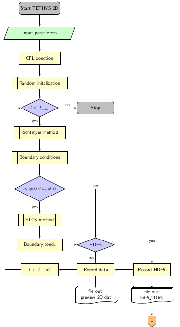
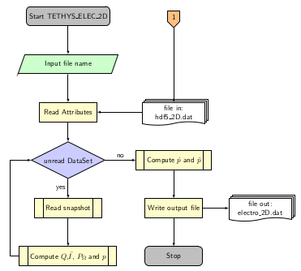
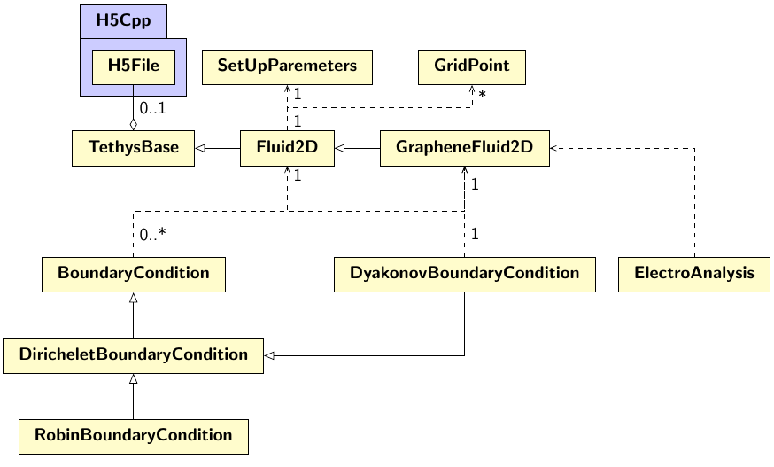

# TETHYS - *Two-dimensional Emitter of THz, Hydrodynamic Simulation.*
## Version 2.6.0

[](https://zenodo.org/badge/latestdoi/208904575)


[](https://www.code-inspector.com/project/1694/score/svg)
[](https://www.code-inspector.com/project/1694/status/svg)
[](https://www.codefactor.io/repository/github/pcosme/tethys-graphene-hydrodynamic-simulation)


## Documentation


The full documentation can be generated with Doxygen simply running 
```console
$ doxygen Doxyfile
```
from the root directory

<!--- ## Richtmyer method implementation --->
<!--- Repository for the elaboration of the hydrodynamic model simulation. --->
<!--- Implemented for in 1D+1 and 2D+1 for density and velocity fields. --->

## Simplified flowchart of the code




## Requirements 

* gcc compiler 

* cmake (version 3.16)

  <small>To generate the makefiles</small>

* OpenMP<sup><small>&reg;</small></sup>

  <small>Responsible for CPU parallelization.</small>

* HDF5<sup><small>&reg;</small></sup> libraries (version 1.8.20 or higher) 

  <small>For the writing of the complete data.</small>
  
_<small>As an example in Fedora systems it should be enough to install the packages: cmake; libgomp; libomp; hdf5; hdf5-devel; hdf5-static </small>_
  
  

### Optional 

* Doxygen 

  <small>For generating the documentation</small>

* Gnuplot & Python

  <small>For the plotting</small>
  
## Usage   
### Compilation
For the compilation of the source code a makefile can ge automatically generated with cmake. It is generally a sensible idea to create an empty directory to hold the executable files

```console
$ mkdir build
$ cd build
```
And then, for the compilation itself. 
```console
$ cmake ..
$ make all
```

### Running a simulation
#### 1) Fluid simulation
To run a simulation one can simply invoke
```console
$ ./TETHYS_2D 
```
and the program will prompt the user to provide the necessary parameters for the simulation.
The necessary inputs are:
* Sound velocity S (vel_snd)
* Fermi velocity v<sub>F</sub> (vel_fer)
* Collision, of the electrons with impurities or defects, frequency (col)
* Shear viscosity (vis)
* Odd viscosity (odd)
* Cyclotron frequency (cyc)
* Thermal diffusivity (therm)
* Saving option (save_mode)
and optionally:  
* Aspect ratio of the simulation grid x:y (aspect_ratio)

Alternatively, the user can pass directly such parameters as command arguments with 
```console
$ ./TETHYS_2D vel_snd vel_fer col vis odd cyc therm save_mode aspect_ratio
```
Moreover, the parameters can also be passed via a `.ini` file 
```console
$ ./TETHYS_2D parameters.ini
```
As standard with .ini files sections can be indicated by square brackets as in [section] and comment lines start with a semicolon ; The readble keywords are

| Keywords | Parameter |   |
| ----: | :----: | :---: |
|  sound   | Sound velocity     |  _S_     |
|  fermi   | Fermi velocity     | _v<sub>0</sub>_     |
|  shear   | Shear viscosity     |  _&nu;<sub>s</sub>_    |
|  odd   |  Odd/Hall viscosity    | _&nu;<sub>o</sub>_     |
|  col   |  Collision frequency    |  1/_&tau;_     |
|  cycl   |  Cyclotron frequency    | _&omega;<sub>c</sub>_     |
|  therm   |  Thermal diffusivity    |  _&alpha;_|
|  aspect   |  Aspect ratio    |  _AR_     |
|  time   |  Simulation time    |  _T<sub>max</sub>_     |
|  save   |  Save mode    | -    |

#### 2) Electrical response 
To later extract the electronic quantities from the fluid simulation data one should run

```console
$ ./TETHYS_ELEC_2D [name of output file].h5
```


### Output description

The user can opt for simplified or full output.

In the simplified version the output is a data file named ``preview_2D<...>.dat`` organised by tab separated columns with the (normalised) values of time, density at x=L, x component of velocity  at x=L , density  at x=0 and x component of velocity  at x=0 (by this order).

The full output option will return a HDF5 file, ``hdf5_2D<...>.h5``, with the data of density, both velocity components and temperature, besides all the relevant simulation parameters saved as attributes of the file. Each HDF5 file has a root group called Data that houses the simulation attributes as well as the groups Density, VelocityX, VelocityY and Temperature, inside each of these three groups the simulation results are stored for each temporal snapshot, organised in a matricial form.


```
hdf5_2D<...>.h5
└─📂Data
    │ Atributes
    │ Sound Velocity
    └─📂 Density
    │ │ 📄 snapshot_00000
    │ │ 📄 snapshot_00001
    │ │ 📄 snapshot_00002
    │ ... 
    └─📁 VelocityX
    └─📁 VelocityY
    └─📁 Temperature
```


## Class Hierarchy



## Style guide

### Semantic Versioning

Standard form of numeric *major.minor.patch* starting with the initial commit 1.0.0. Small (but relevant) bugs are considered lower level patches and new features (such as updating physical model) are minor level. Major level versions should be saved for breaking updates (like 2D implementation or parallelization)

#### Version history
**1.0.0** Initial commit *[16 Sep. 2019]*

**1.1.0** Updated nonlinear terms in velocity flux, explicit pressure term. (minor changes in variables).

**1.2.0** Addition of collisional loss term.
  <br>&emsp;**1.2.1** Mean free path added as command line parameter. 
  <br>&emsp;**1.2.2** Update of frequency functions + minor changes in appearance. 
  <br>&emsp;**1.2.3** Added warning for the case on non-propagating plasmons + beginning implementation of CI tasks. *[17 Nov. 2019]*
  <br>&emsp;**1.2.4** New CFL condition.
  <br>&emsp;**1.2.5** Output in HDF5 format. *[8 Jan. 2020]*
  
**1.3.0** Transition to object-oriented code. Addition of Time Series Analysis and Electronic properties extraction. *[1 May. 2020]*
  <br>&emsp;**1.3.1** Stored energy at the capacitor gate calculated.  
  <br>&emsp;**1.3.2** Viscosity term for Reynolds >10 implemented. *[26 May. 2020]*
  <br>&emsp;**1.3.3** New class hierarchy on 1D algorithms. *[26 Jun. 2020]*
  <br>&emsp;**1.3.4** Boundary conditions implemented as a separate class *[28 Jun. 2020]*

**2.0.0** Two dimensional code implementation. 1D version maintained for fast/simpler simulations. *[22 Jun. 2020]* 
  <br>&emsp;**2.0.1** New class hierarchy on 2D algorithms. New organization of header files *[26 Jun. 2020]*
  <br>&emsp;**2.0.2** Boundary conditions implemented as a separate class *[28 Jun. 2020]*
  <br>&emsp;**2.0.3** Linear _for_ loops *[29 Jun. 2020]*
  <br>&emsp;**2.1.0** Magnetic Field inclusion with _Godunov Splitting_ *[22 Jul. 2020]* 
  <br>&emsp;**2.2.0** Shear viscosity with FTCS method. Variable Aspect ratio  *[20 Sep. 2020]*
  <br>&emsp;**2.2.1** Momentum relaxation in 2D simulations *[24 Oct. 2020]*
  <br>&emsp;**2.3.0** (1,9) Weighted explicit method for viscous terms *[17 Nov. 2020]*
  <br>&emsp;**2.3.1** Parallelization with OpenMP  *[25 Nov. 2020]*
  <br>&emsp;**2.4.0** Simulation with odd viscosity  *[12 Feb. 2021]*
  <br>&emsp;**2.5.0** Energy transport by conduction and convection  *[22 May. 2021]*
  <br>&emsp;**2.5.1** Initialization by .ini file import  *[30 Jun. 2021]*
  <br>&emsp;**2.5.2** cmake update   *[29 Aug. 2021]*
<br>&emsp;**2.6.0** Joule heating source added  *[6 Oct. 2021]*
### Internal syntax

| Type            | Style                                 | E.g.              |
| :-------------: |:-------------:                        | :-----            |
| *Macros*          | Prefix + _ + Upper-case                | MAT_PI            |
| *Functions*       | Camel case                            | InitialCondRand   |
| *Variables*       | Lower-case 3 letters code + suffix     | den_mid           |

